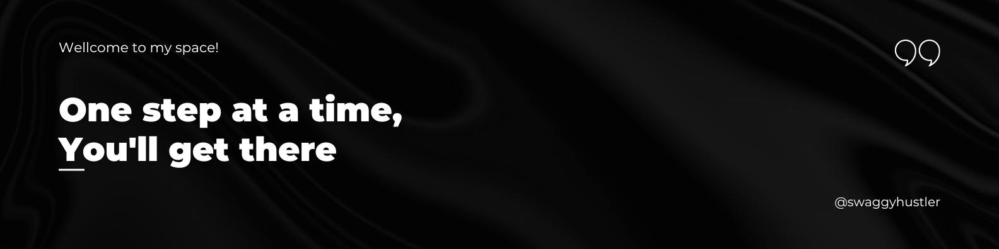

# 👋 Hey Y'all
This is `Gedam Subhash` a Technological Enthusiast, a Persistent Developer.
An open minded person with interest in Technology and I like engaging with new people.
## 💻Tech Stack and Tools
- **Technologies**: MERN Stack Development, PostgreSQL, API's
- **Languages**: C, C++, Python, Java, HTML, CSS, JavaScript ...
- **Libraries & Frameworks**: JQuery, Bootstrap, Hibernate, Spring ...
- **Tools and Platforms**: Git, GitHub, VScode, Eclipse ...
## 🤝Socials
- **LinkedIn:** [Let's connect on LinkedIn](https://www.linkedin.com/in/subhash-gedam/)
- **X:** [Hit me up at X](https://twitter.com/swaggyhustler)
## 📈GitHub Stats
<!--  -->
<h2> My Contribution Stats 📈</h2>
 

<!--
**gedamsubhash/gedamsubhash** is a ✨ _special_ ✨ repository because its `README.md` (this file) appears on your GitHub profile.

Here are some ideas to get you started:

- 🔭 I’m currently working on ...
- 🌱 I’m currently learning ...
- 👯 I’m looking to collaborate on ...
- 🤔 I’m looking for help with ...
- 💬 Ask me about ...
- 📫 How to reach me: ...
- 😄 Pronouns: ...
- ⚡ Fun fact: ...
-->
